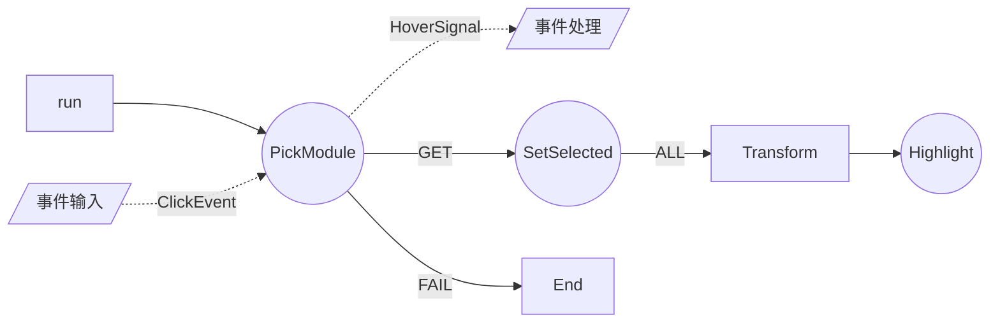
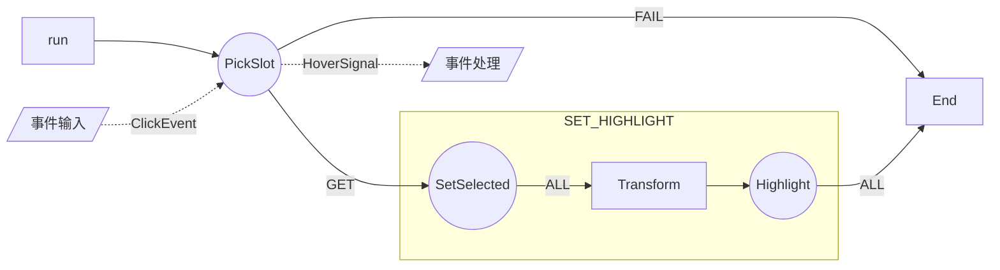

# ToolManager

by sun

工具管理器是为了在合杆合箱的编辑器中实现统一的工具流程并做到工具复用而开发的。

#### 工具复用



#### 流程复用




## *class* ToolManager

##### run

##### call

##### globalData

##### param

## *class* MicroTool

##### autorun

##### event

##### toolData

##### emit

##### sendParam

## *class* FlowGraph

##### Graph

construct a `FlowGraph`

`new FlowGraph(graphTemplate, startNode, *transforms, *signals)`

```js
// construct a graphTemplate

// path
'ToolA:name-FLAG-ToolB:name'
'ToolA-ToolB'					// same as ToolA-ALL-ToolB
'TOOlA-FLAG-Transform-ToolB'	// with Transform
'ToolA:name'							// single tool
'ToolA-SubGraph:graphname'		// subgraph to
'SubGraph:graphname-FLAG-ToolA'	// subgraph from

// combine paths with '|'
'ToolA-FLAG-ToolB|ToolB-FLAG-ToolC'

// StartNode
new FlowGraph('ToolA:name', 'ToolA:name')
new FlowGraph('ToolA-GET-ToolB:name|ToolB:name-FAIL-ToolC', 'ToolA')

// transforms
// transform is a function that convert last param to the input param to be accepted by the next Node 
//e.g. ToolA return param: {str: 'hello'}, ToolB accept param: {string, title} use transform
new FlowGraph('ToolA-ALL-transformFunc-ToolB', 'ToolA', {
	transformFunc(global, param) {
		return {string: param.str, title: 'From ToolA'}
	}
})
```

## perserved Keyword

| FLAG  | ToolName |
| ----- | -------- |
| END   | SubGraph |
| ERROR | LOG      |
| ALL   | BRANCH   |


# 如何使用右键菜单
右键菜单呼叫格式
```js
this.$EventBus.$emit(
		'contextmenu_open',
		父级组件名, 
		[
			'描述文本',
			'-'//分割,
			{text, icon, action, data?, description ?}//选项, { text: '视图', list: [], first: 0 }//二级菜单，支持嵌套，first表示对其项
		],
		data//全局数据,
		event.clientX//显示位置x,
		event.clientY//显示位置y,
		first//默认选中项
		)
```
不使用ICON 请使用 ```icon = 'blank'```
返回数据包含 全局数据 和 选中项专有数据
```action``` 为直接事件名 如 ```action:'display_select_Module'``` 的项目点击后将直接呼叫 ```display_select_Module``` 事件 用 ```this.$EventBus.$on('display_select_Module', (globaldata, localdata)=>{})``` 处理

```action``` 以 ```@``` 开头，如 ```action:'@clear'``` 将会呼叫 ```this.$EventBus.$on('父级组件名_ContextMenu', (action, globaldata, localdata)=>{})``` 处理

特别的在```ModelDisplay``` 中形如 ```action:'@clear'``` 的事件 ```(action = 'clear', globaldata, localdata)```, 在Editor中使用这种action将直接调用当前编辑器中的```clear()```方法
